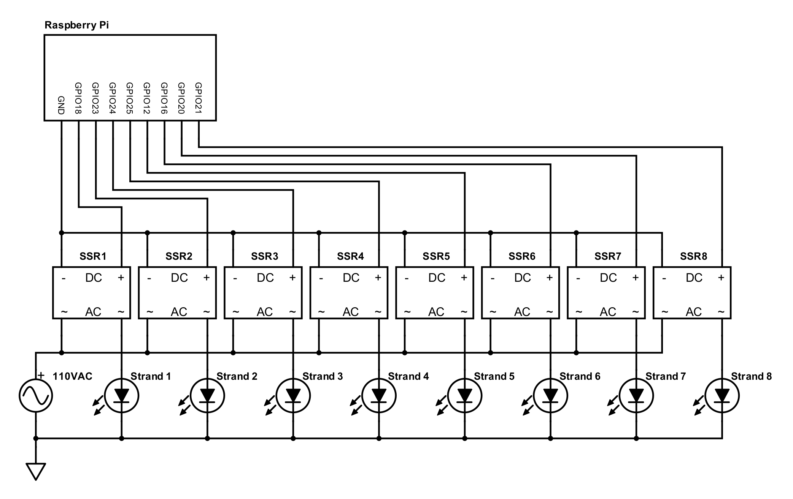
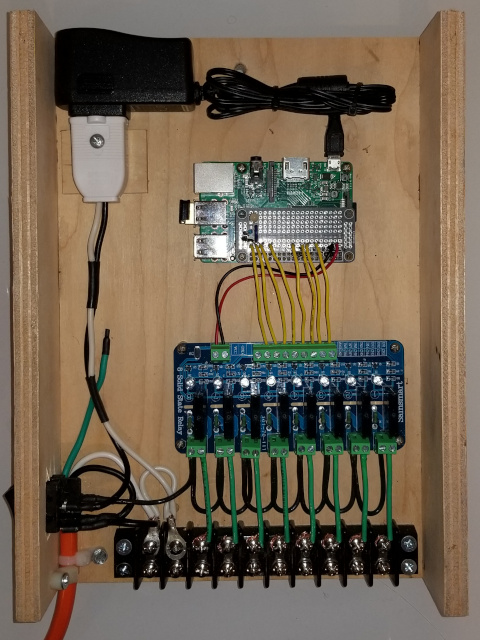

# LightRunner

[](https://chrisarmbruster.com/xmaslights.m4v)

## Project Overview

LightRunner is a customizable solution for orchestrating holiday light shows, blending hardware and software engineering. At its core, LightRunner utilizes a Raspberry Pi with the Node.js runtime, enabling dynamic control over lighting sequences and effects. Designed and developed as a personal project, LightRunner animates eight distinct circuits of holiday lights, creating captivating visual effects. Each iteration of the project, from its initial inception with a TRS-80 Color Computer 2 to the current setup involving a Raspberry Pi and solid-state relays, added more capability. The system's primary charm lies in its ability to switch power across various lighting circuits, choreographing lights for holiday displays.

### [👀 🎬 🍿 Click to Watch the Video Demo](https://chrisarmbruster.com/xmaslights.m4v)

### Generations of LightRunner

- **2020's Design (Current Generation)**:

  - **Platform**: Linux running on an ARM-based Raspberry Pi.
  - **Technologies**: Node.js, JavaScript.
  - **Hardware**: Eight solid-state relays for controlling light circuits.
  - **Focus**: This repository is dedicated to the current design and its comprehensive implementation.
  - **Comments**: Best solution yet.  Memory is no longer a constraint.  Software changes are possible and easy to make.  Door is open for integration with web UI.

- **1990's Design**:

  - **Platform**: Motorola M6800 series 8-bit MCU.
  - **Programming**: Assembly language.
  - **Hardware**: Eight TRIACs for light switching, with opto-isolation/coupling to ensure safe interfacing between the TRIACs and the processor.
  - **Comments**: Much better than the prior generation because it freed up the computer.  This was ultra reliable, but constrained by memory and a design that did not lend itself to software changes.

- **Early Design**:
  - **Platform**: Expansion port on a TRS-80 Color Computer 2.
  - **Programming**: Assembly language.
  - **Hardware**: Utilized TRIACs for light switching, featuring opto-isolation/coupling for processor safety and reliability.
  - **Comments**: It worked, but not a good solution because it tied up the family computer for the holiday season.  Nevertheless, a good proof of concept.

<br>

## Getting Started

### Hardware Requirements

1. **Raspberry Pi**: LightRunner has been tested and is compatible with the following Raspberry Pi models:

   - Raspberry Pi 1 Model B+
   - Raspberry Pi 2 Model B
   - Raspberry Pi Zero W
   - Raspberry Pi 4 Model B

2. **Solid-State Relays (SSRs)**: The system requires eight solid-state relays for controlling the AC strands of lights. Note that there are 8-Channel Solid State Relay Boards available for purchase that can be used in place of the individual SSRs (I use one manufactured by SainSmart).

3. **AC Strands of LED Lights**: Each SSR is connected to an individual AC strand of LED lights (or incandescent lights if you prefer, providing the SSRs are rated for the load).

4. **General Electronic Components**: Basic electronic components including wires, connectors, and optionally, a PCB for assembling the circuit.

#### Circuit Schematic



This schematic is a practical guide for the hardware component of LightRunner. It details the integration of a Raspberry Pi with eight solid-state relays (SSRs) for controlling holiday light displays. The schematic and software are compatible with various Raspberry Pi models including Pi 1 Model B+, Pi 2 Model B, Pi Zero W, and Pi 4 Model B. Each SSR is labeled to differentiate the DC control side from the AC switching side. The GPIO pins of the Raspberry Pi are used for controlling the DC side of the SSRs, which in turn, manage the switching on the AC side. This setup allows for control of the connected AC strands of LED lights. Please note that the GPIO designations are used in the schematic, not the physical pin locations, so careful attention should be paid when making connections.

<br>

#### Example Build



<br>

### Software Requirements

1. **Linux Operating System**: A suitable Linux distribution installed on the Raspberry Pi. Compatibility with popular distributions like Raspbian (Raspberry Pi OS), Ubuntu for Pi, etc., is recommended. I used Raspbian. There are plenty of resources available on the web for installing this and other Linux distributions on the Pi.

2. **Node.js**: The latest stable version of Node.js that your hardware and OS support to run the JavaScript code that LightRunner is written in. Again, there are resources available on the web for installing Node.js on the Pi and may depend on the Pi model and Linux distribution you are using.

### Installation & Usage

Follow these steps to set up LightRunner on your Raspberry Pi:

#### Step 1: Clone the Repository

Clone the LightRunner repository to your Raspberry Pi.

```bash
git clone [URL of the LightRunner repository]
```

#### Step 2: Install Dependencies

```bash
cd light-runner
npm install
```

This command will automatically install all the dependencies listed in your package.json file.

#### Step 3: Configuration

Before running LightRunner, you'll need to configure some initial settings by editing the variables at the top of the main code file. Here's a brief overview of each variable and how to customize them:

- `mode = "show"`: Sets the default mode of the light show (show, allon, alloff, setup, shimmer, twinkle, scenes). You can override this with the command line option `-m:string`.

- `cycles = 5`: The default base cycles per scene. Override with `-c:number` in the command line.

- `delay = 50`: The base delay in milliseconds between state changes (controls the speed of the routine). Override with `-d:number`.

- `latitude = 42.192324`: Your geographic latitude in decimal form, used for calculating sunset times.

- `longitude = -88.088098`: Your geographic longitude in decimal form, also for sunset calculations.

- `elevation = 260`: Your elevation in meters, which factors into sunset time calculations.

- `startTime = 1020`: The start time of the light show in minutes (e.g., 1:30 PM is `13 * 60 + 30`). This can be overridden by sunset times.

- `stopTime = 1430`: The stop time for the light show, in minutes. Ensure this time is before midnight.

- `state = "off"`: Maintains the current state of the light show. This is used internally by the program.

Adjust these variables to match your specific requirements. Once configured, you can proceed to run LightRunner.

#### Step 4: Run LightRunner

To run LightRunner, execute the following command from the root directory of the project:

##### Basic Usage

```bash
node lightRunner.js
```

##### Command-Line Arguments

You can customize the behavior of LightRunner using the following arguments:

    -m: Sets the mode of the light show. Available options include show, allon, alloff, setup, shimmer, twinkle, scenes.
    -c: Specifies the base number of cycles to run for each scene. It should be an integer.
    -d: Sets the base delay in milliseconds between lighting changes (duration of a flash).

Example:

```bash
node lightRunner.js -m:show -c:5 -d:50
```

#### Step 5: Automate Startup

##### Make a Startup Script

To run LightRunner at startup, you'll need to create a script that will start the program using Node.js. Create a script called `runlights.sh` and add it to the `/home/{user}/code` directory. The contents of the script should be as follows:

```bash
#!/bin/bash
while true; do
  node /home/{user}/code/light-runner/lightRunner.js > /home/{user}/code/light-runner/lights.log 2>&1
  if [ $? -eq 0 ]; then break; fi
done
```

Replace {user} with your actual username. This script:

- Starts xmaslights.js using Node.js.
- Automatically restarts the program if it crashes.
- Redirects all output to lights.log.

##### Add a Cron Job

To invoke the script at boot up, you'll need to create a cron job. Open the cron editor with:

```bash
sudo crontab -e
```

Add the following to the file:

```bash
@reboot sudo /home/{user}/code/runlights.sh
```

##### Terminating the Program

Should you need to terminate the program, log into the Pi through a terminal and type:

```bash
sudo top | grep node
```

This will discover the PID# of the process. Then enter:

```bash
sudo kill -2 PID#
```

substituting the PID#.

##### Restarting the Program

To restart the process without a reboot, enter the following from within the `/home/{user}/code` directory as root:

```bash
nohup ./runlights.sh > /home/{user}/code/light-runner/lights.log
```

This redirects terminal output to the lights.log file and ignores any "hangups" due to a terminal closing or logged in system suspending.

<br>

## Engineers

🧑 [Chris Armbruster](https://github.com/chrisallenarmbruster)

<br>

## License

Copyright (c) 2023 Rev4Labs

This project is MIT licensed.
